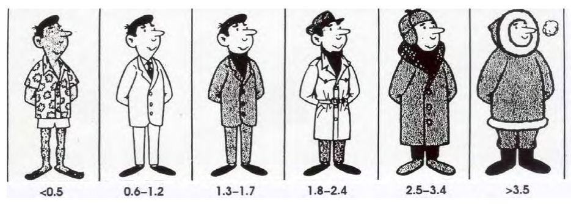

# WhatToWear
WhatToWear is an android app where users can add their clothing items and the app will recommend outfits based on the day's weather.

Once the user has enough clothing entered into their virtual wardrobe, the app will obtain the day's weather forecast and create sample outfits most comfortable for that day's weather. Below are some examples of outfit recommendations.

 98 °F        | 73 °F          | 67 °F         | 33 °F         |
:-------------------------:|:-------------------------:|:-------------------------:|:-------------------------:
 |  |  | 

In addition to the Outfit tab, the user can view the hourly weather tab or their wardrobe tab. From the wardrobe tab, users can enter new clothing items or edit existing ones.

 Weather Tab          | Wardrobe Tab        
:-------------------------:|:-------------------------:
 |  

## APIs / External Dependencies
* [weatherbit.io](https://www.weatherbit.io/api) is a weather data API used to retreive daily forecasts. The app interfaces with the [Free Tier API](https://www.weatherbit.io/pricing) of Weatherbit which allows a maximum of 500 calls per day.

* [GabrielBB/Android-CutOut](https://github.com/GabrielBB/Android-CutOut) is a package for image background removal. In this app, it is used to remove the backgrounds from user-uploaded images for a cleaner appearance.

## How Outfit Selection Works
WhatToWear determines the best outfit by implementing the [clo model](https://www.engineeringtoolbox.com/clo-clothing-thermal-insulation-d_732.html) of clothing comfort. Clo is a unit of thermal insulating value where:
* 1 clo corresponds to the insulating value of clothing needed to maintain a person in comfort sitting at rest in a room at 21 °C (70 °F) with air movement of 0.1 m/s and humidity less than 50% - typically a person wearing a business suit.
* 0 clo corresponds to a naked person.

||
|:--:|
| <b>Insulation of a range of outfits in clo units. ( Auliciems A. et al, 2007, p.9 )</b>|

Referencing the above image, the following mapping of apparent temperature to clo was estimated:  
*desired_clo = -0.072 x apparent_temp(in °C) + 2.5*

The app must also calculate the clo value of individual user-entered clothing items. The clo estimation requires the weight of the item and the fabric blend information to estimate the thermal resistance of the item.

The clo value of a complete outfit is given by the sum of its component clo values scaled by 0.82:  
*total_outfit_clo = 0.82 x sum(individual item clo values)*

## Future Improvements
1. Randomization / Jitter  
	If the temperature does not vary much day to day, then the outfit recommendations could be repeated for multiple days on end.
	Some small random jitter added to the desired clo can help force some day to day variety without making the recommendations impractical for the given temperatures.

2. Image Recognition  
	Currently users are prompted to enter many details for each clothes entry,	weight, fabric blend, category (e.g. t-shirt, pants, skirt, etc).
	It would be preferable to only require users to upload a picture of the item and have the app try to classify the item and estimate the clo value.
 
3. Web service for user data storage  
 In the current form of this app, all the user data is stored locally. If the user uninstalls and reinstalls or installs on a new phone, none of their data is backed  up. A separate project would be to implement and deploy a web server to manage all users' data. Users would be required to create WhatToWear accounts and all create, update, delete operations performed by users on their virtual wardrobes would happen on the web server as well as locally.

## Background
I started this project after completing the [Android Basics by Google](https://www.udacity.com/course/android-basics-nanodegree-by-google--nd803) course on Udacity. I took the course in early 2019 when the language taught was Java. The course taught multi-screen UIs, adapting data to list views, accepting user input, managing local SQLite databases, and connecting to web APIs. The scope of this project aimed to incorporate my learnings from all the course modules.
